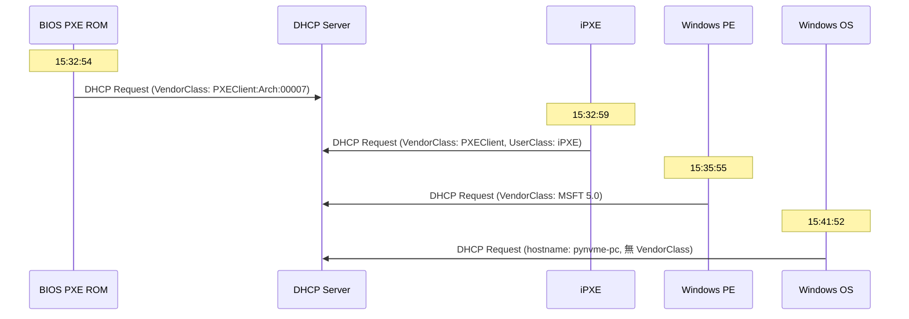

# DHCP 日誌 iPXE 資訊檢測分析報告

## 📋 問題描述

在 DHCP Server 分析的日誌查看中，**無法分辨出 iPXE 的資訊**，但使用 Windows PowerShell 的 `findstr` 命令可以看到 iPXE 相關記錄。

---

## 🔍 為什麼 findstr 可以看到 iPXE 資訊？

### 您的 findstr 命令
```bash
findstr /i "BCFCE73A61C9 BCFCE73A6210 60CF84BCB756 60CF84DCB330 60CF84BCB05C" C:\Windows\System32\dhcp\DhcpSrvLog-Sat.log
```

### 實際的 Windows DHCP 日誌格式（完整版）

```
11,10/18/25,15:32:54,Renew,10.250.132.27,,BCFCE73A61C9,,610079976,0,,,,0x505845436C69656E74...PXEClient:Arch:00007:UNDI:003016
                                                                            ↑↑↑↑↑↑↑↑↑↑↑↑↑↑↑↑↑↑↑↑↑↑↑↑↑↑↑↑↑↑↑↑↑↑↑↑↑↑↑↑↑↑
                                                                            這裡包含 DHCP Option 60 (Vendor Class Identifier)
                                                                            以及 Option 97 (Client UUID) 等資訊

11,10/18/25,15:32:59,Renew,10.250.132.27,,BCFCE73A61C9,,727830406,0,,,,0x505845436C69656E74...PXEClient:Arch:00007:UNDI:003010,0x69505845,iPXE
                                                                                                                              ↑↑↑↑↑↑↑↑↑↑↑↑↑↑↑↑
                                                                                                                              這裡明確標示 "iPXE"
11,10/18/25,15:34:08,Renew,10.250.132.27,pynvme-pc,BCFCE73A61C9,,591599293,0,,,,,,,,,0
                                                                                      ↑
                                                                                      沒有 DHCP Options，這是正常 OS 運行

11,10/18/25,15:35:55,Renew,10.250.132.27,minint-pkc1vk8,BCFCE73A61C9,,313489413,0,,,,0x4D53465420352E30,MSFT 5.0
                                                                                        ↑↑↑↑↑↑↑↑↑↑↑↑↑↑↑↑↑↑↑↑
                                                                                        Windows PE/WinPE 的標識
```

### Windows DHCP 日誌的完整欄位結構

根據 Microsoft 官方文檔，DHCP 日誌格式為：

```
ID,Date,Time,Description,IP Address,Host Name,MAC Address,User Name,TransactionID,QResult,Probationtime,CorrelationID,Dhcid,VendorClass(Hex),VendorClass(ASCII),UserClass(Hex),UserClass(ASCII),RelayAgentInformation,DnsRegError
```

**重點欄位**：
- **欄位 13**: `VendorClass(Hex)` - DHCP Option 60 的十六進制表示
- **欄位 14**: `VendorClass(ASCII)` - DHCP Option 60 的 ASCII 表示（**iPXE 識別的關鍵！**）
- **欄位 15**: `UserClass(Hex)` - DHCP Option 77 的十六進制表示
- **欄位 16**: `UserClass(ASCII)` - DHCP Option 77 的 ASCII 表示

**範例解析**：
```
11,10/18/25,15:32:59,Renew,10.250.132.27,,BCFCE73A61C9,,727830406,0,,,,0x505845436C69656E74...PXEClient:Arch:00007:UNDI:003010,0x69505845,iPXE
   ↑  ↑         ↑      ↑     ↑                ↑                ↑    ↑                                                            ↑         ↑
  ID  Date     Time  Event  IP               MAC              ...  Option 60 (Hex)                                          Option 77  "iPXE"
```

---

## ❌ 目前系統為什麼無法識別 iPXE？

### 當前代碼的問題

**檔案**: `/backend/api/services.py` - `WindowsDHCPLogParser` 類別

```python
@staticmethod
def parse_log_lines(lines, limit=1000):
    for line in lines:
        # 分割欄位（用逗號分隔）
        fields = line.split(',')
        
        if event_id in ['10', '11', '12', '13']:  # Assign, Renew, Release, Deny
            ip_address = fields[4].strip() if len(fields) > 4 else '-'
            hostname = fields[5].strip() if len(fields) > 5 else '-'
            mac_address = fields[6].strip() if len(fields) > 6 else '-'
            
            # ❌ 問題：只解析到 MAC 地址（欄位 6）就停止了！
            # ❌ 沒有解析欄位 13-16 的 DHCP Options
            
            message = f'DHCPREQUEST for {ip_address} from {mac_address} via eth0'
```

### 缺失的關鍵資訊

目前的解析器：
- ✅ 解析了：ID, Date, Time, Event, IP, Hostname, MAC
- ❌ **沒有解析**：欄位 8-18 的資訊
  - 欄位 13: `VendorClass(Hex)` - PXE Client 的十六進制標識
  - 欄位 14: `VendorClass(ASCII)` - **"PXEClient"**, **"iPXE"** 等關鍵字
  - 欄位 16: `UserClass(ASCII)` - **"iPXE"**, **"MSFT 5.0"** 等標識

---

## 🎯 iPXE 檢測的關鍵特徵

根據您提供的日誌，iPXE 客戶端有以下特徵：

### 1. **PXE 啟動階段**（初始 PXE ROM）
```
0x505845436C69656E74...PXEClient:Arch:00007:UNDI:003016
↑
Option 60 包含 "PXEClient" 字樣
```

### 2. **iPXE 階段**（加載 iPXE 後）
```
0x505845436C69656E74...PXEClient:Arch:00007:UNDI:003010,0x69505845,iPXE
                                                          ↑         ↑
                                                    Option 77 (Hex)  明確的 "iPXE" 標識！
```

### 3. **Windows PE 階段**
```
0x4D53465420352E30,MSFT 5.0
↑                  ↑
Option 60 (Hex)    Windows PE 標識
```

### 4. **正常 OS 運行**
```
,,,,,,,,,0
↑
沒有 DHCP Options
```

---

## 📊 完整的生命週期

根據您的日誌，一台機器的完整啟動流程：



**時間軸範例**（BC:FC:E7:3A:61:C9）：
- **15:32:54** - BIOS PXE ROM（PXEClient:Arch:00007）
- **15:32:59** - iPXE（明確標示 "iPXE"）
- **15:34:08** - 正常 OS（hostname: pynvme-pc）
- **15:35:11~15:35:23** - 多次 iPXE 續租
- **15:35:55** - Windows PE（MSFT 5.0）
- **15:41:52** - 最終進入 Windows OS

---

## 💡 識別 iPXE 的邏輯

### 方法 1: 檢查 UserClass (Option 77)
```python
if 'iPXE' in fields[16]:  # UserClass(ASCII) 欄位
    client_type = 'iPXE'
```

### 方法 2: 檢查 VendorClass (Option 60)
```python
if 'PXEClient' in fields[14]:  # VendorClass(ASCII) 欄位
    if 'iPXE' in fields[16]:
        client_type = 'iPXE'
    else:
        client_type = 'PXE'
elif 'MSFT' in fields[14]:
    client_type = 'WinPE'
else:
    client_type = 'OS'
```

### 方法 3: 綜合判斷（最準確）
```python
vendor_class_ascii = fields[14] if len(fields) > 14 else ''
user_class_ascii = fields[16] if len(fields) > 16 else ''
hostname = fields[5] if len(fields) > 5 else ''

if 'iPXE' in user_class_ascii or 'iPXE' in vendor_class_ascii:
    client_type = 'iPXE'
    boot_stage = 'iPXE Loading'
elif 'PXEClient' in vendor_class_ascii:
    client_type = 'PXE'
    boot_stage = 'BIOS PXE'
elif 'MSFT' in vendor_class_ascii or 'minint-' in hostname:
    client_type = 'WinPE'
    boot_stage = 'Windows PE'
elif hostname and hostname != '-':
    client_type = 'OS'
    boot_stage = 'Operating System'
else:
    client_type = 'Unknown'
    boot_stage = 'Unknown'
```

---

## 📝 實際日誌範例分析

### 範例 1: iPXE 階段
```
11,10/18/25,15:32:59,Renew,10.250.132.27,,BCFCE73A61C9,,727830406,0,,,,0x505845436C69656E74...PXEClient:Arch:00007:UNDI:003010,0x69505845,iPXE
```

**解析結果應該是**：
```python
{
    'event_id': '11',
    'event_type': 'Renew',
    'timestamp': '2025-10-18 15:32:59',
    'ip_address': '10.250.132.27',
    'hostname': '',
    'mac_address': 'bc:fc:e7:3a:61:c9',
    'vendor_class_hex': '0x505845436C69656E74...',
    'vendor_class_ascii': 'PXEClient:Arch:00007:UNDI:003010',  # ← 包含 PXEClient
    'user_class_hex': '0x69505845',
    'user_class_ascii': 'iPXE',  # ← 明確標示 iPXE
    'client_type': 'iPXE',  # ← 應該識別為 iPXE
    'boot_stage': 'iPXE Loading'
}
```

### 範例 2: Windows PE 階段
```
11,10/18/25,15:35:55,Renew,10.250.132.27,minint-pkc1vk8,BCFCE73A61C9,,313489413,0,,,,0x4D53465420352E30,MSFT 5.0
```

**解析結果應該是**：
```python
{
    'event_id': '11',
    'event_type': 'Renew',
    'timestamp': '2025-10-18 15:35:55',
    'ip_address': '10.250.132.27',
    'hostname': 'minint-pkc1vk8',  # ← Windows PE 的臨時主機名
    'mac_address': 'bc:fc:e7:3a:61:c9',
    'vendor_class_hex': '0x4D53465420352E30',
    'vendor_class_ascii': 'MSFT 5.0',  # ← Windows PE 標識
    'client_type': 'WinPE',  # ← 應該識別為 Windows PE
    'boot_stage': 'Windows PE'
}
```

### 範例 3: 正常 OS 運行
```
11,10/18/25,15:41:52,Renew,10.250.132.27,pynvme-pc,BCFCE73A61C9,,2837896269,0,,,,,,,,,0
```

**解析結果應該是**：
```python
{
    'event_id': '11',
    'event_type': 'Renew',
    'timestamp': '2025-10-18 15:41:52',
    'ip_address': '10.250.132.27',
    'hostname': 'pynvme-pc',  # ← 正常的主機名
    'mac_address': 'bc:fc:e7:3a:61:c9',
    'vendor_class_hex': '',
    'vendor_class_ascii': '',  # ← 沒有 VendorClass
    'client_type': 'OS',  # ← 應該識別為正常 OS
    'boot_stage': 'Operating System'
}
```

---

## 🔧 需要改進的地方

### 1. **擴展解析器** - 解析更多欄位
```python
# 目前只解析 7 個欄位
fields[0:7] = [ID, Date, Time, Description, IP, Hostname, MAC]

# 應該解析全部 19 個欄位
fields[0:19] = [
    ID, Date, Time, Description, IP, Hostname, MAC, Username,
    TransactionID, QResult, Probationtime, CorrelationID, Dhcid,
    VendorClass(Hex), VendorClass(ASCII),  # ← 關鍵！
    UserClass(Hex), UserClass(ASCII),       # ← 關鍵！
    RelayAgentInfo, DnsRegError
]
```

### 2. **添加客戶端類型識別**
```python
def identify_client_type(fields):
    """識別客戶端類型（iPXE, PXE, WinPE, OS）"""
    vendor_class = fields[14] if len(fields) > 14 else ''
    user_class = fields[16] if len(fields) > 16 else ''
    hostname = fields[5] if len(fields) > 5 else ''
    
    # 識別邏輯...
    return client_type, boot_stage
```

### 3. **前端顯示增強**
在日誌列表中添加欄位：
- **客戶端類型**：iPXE / PXE / WinPE / OS
- **啟動階段**：BIOS PXE / iPXE Loading / Windows PE / Operating System
- **Vendor Class**：顯示 Option 60 的內容
- **User Class**：顯示 Option 77 的內容

### 4. **提供 iPXE 專屬篩選**
```javascript
// 前端篩選器
<Select placeholder="客戶端類型">
    <Option value="all">全部</Option>
    <Option value="iPXE">iPXE</Option>
    <Option value="PXE">PXE (BIOS)</Option>
    <Option value="WinPE">Windows PE</Option>
    <Option value="OS">Operating System</Option>
</Select>
```

---

## 📈 改進後的效果

### 目前的日誌顯示
```
時間              | 事件  | IP             | 主機名      | MAC                | 訊息
2025-10-18 15:32:59 | Renew | 10.250.132.27 | -          | bc:fc:e7:3a:61:c9 | DHCPREQUEST for 10.250.132.27...
```

### 改進後的日誌顯示
```
時間              | 事件  | IP             | 主機名         | MAC                | 客戶端類型 | 啟動階段      | Vendor Class        | User Class
2025-10-18 15:32:54 | Renew | 10.250.132.27 | -             | bc:fc:e7:3a:61:c9 | PXE       | BIOS PXE     | PXEClient:Arch:00007 | -
2025-10-18 15:32:59 | Renew | 10.250.132.27 | -             | bc:fc:e7:3a:61:c9 | iPXE      | iPXE Loading | PXEClient:Arch:00007 | iPXE ← 明確標示！
2025-10-18 15:35:55 | Renew | 10.250.132.27 | minint-pkc1vk8| bc:fc:e7:3a:61:c9 | WinPE     | Windows PE   | MSFT 5.0            | -
2025-10-18 15:41:52 | Renew | 10.250.132.27 | pynvme-pc     | bc:fc:e7:3a:61:c9 | OS        | OS Running   | -                   | -
```

---

## 🎯 總結

### 為什麼 findstr 可以看到 iPXE？
- ✅ `findstr` 搜尋整行文字，包含所有欄位（特別是欄位 14 和 16）
- ✅ 日誌中明確包含 **"iPXE"** 字樣（欄位 16: UserClass ASCII）
- ✅ 可以看到 **"PXEClient"**、**"MSFT 5.0"** 等標識

### 為什麼目前系統無法識別？
- ❌ 解析器只解析到欄位 6（MAC 地址）就停止
- ❌ **沒有解析欄位 13-16**（VendorClass 和 UserClass）
- ❌ 沒有客戶端類型識別邏輯
- ❌ 前端沒有顯示相關欄位

### 改進方向
1. **擴展解析器** - 解析完整的 19 個欄位
2. **添加識別邏輯** - 根據 VendorClass 和 UserClass 判斷客戶端類型
3. **數據庫欄位** - 在 DHCPLog 模型添加 `client_type`, `vendor_class`, `user_class` 欄位
4. **前端增強** - 顯示客戶端類型和啟動階段，提供篩選功能

---

**分析完成日期**: 2025-10-29  
**相關文檔**: 
- Windows DHCP 日誌格式: https://docs.microsoft.com/en-us/previous-versions/windows/it-pro/windows-server-2008-R2-and-2008/dd183591(v=ws.10)
- DHCP Option 60 (Vendor Class): RFC 2132
- DHCP Option 77 (User Class): RFC 3004
