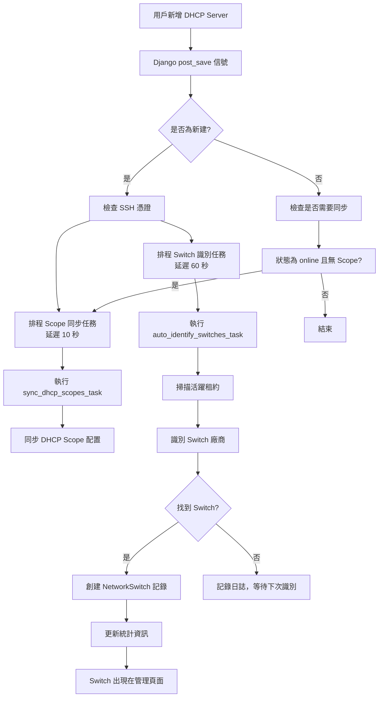

# 自動 Switch 同步機制

## 📋 概述

本文檔說明當新增 DHCP Server 後，系統如何自動識別和同步 Switch 設備，避免需要手動點擊「立即同步」按鈕。

## 🎯 問題背景

### 原問題

當新增一個 DHCP Server（例如：10.250.120.1）後，在 Switch 管理頁面沒有顯示任何資料：

- ✅ DHCP Server 已創建
- ✅ 租約已同步（306 筆）
- ✅ 租約中有 Switch 設備（4 個 Zyxel）
- ❌ **Switch 管理頁面顯示 0 個 Switch**

**根本原因**：Switch 需要從租約中識別並創建記錄，但沒有自動觸發識別任務。

## ✅ 改善方案

### 核心機制：Django Signals

使用 Django 的信號機制（Signals），在 DHCP Server 創建時自動觸發相關任務。

#### 實現位置

文件：`backend/api/signals.py`

### 自動化流程

```
新增 DHCP Server
    ↓
post_save 信號觸發
    ↓
┌─────────────────────────────────┐
│  1. Scope 同步任務（10 秒後）    │  ← 同步 DHCP Scope 配置
└─────────────────────────────────┘
    ↓
┌─────────────────────────────────┐
│  2. Switch 識別任務（60 秒後）   │  ← 🆕 自動識別 Switch
└─────────────────────────────────┘
    ↓
Switch 出現在管理頁面 ✅
```

## 🔧 技術實現

### 1. 信號處理器

```python
@receiver(post_save, sender=DHCPServer)
def dhcp_server_post_save(sender, instance, created, **kwargs):
    """DHCP Server 創建或更新後的自動化處理"""
    
    if created:  # 新建伺服器
        # 任務 1：同步 Scope（10 秒後）
        sync_dhcp_scopes_task.apply_async(
            args=[instance.id],
            countdown=10
        )
        
        # 任務 2：識別 Switch（60 秒後）
        auto_identify_switches_task.apply_async(
            kwargs={'server_id': instance.id},
            countdown=60
        )
```

**延遲時間說明**：
- **Scope 同步**：10 秒延遲，給用戶時間配置 SSH 憑證
- **Switch 識別**：60 秒延遲，等待租約數據同步完成

### 2. Switch 識別邏輯

位置：`backend/api/tasks.py` → `auto_identify_switches_task`

**識別方式**：
1. 掃描所有活躍租約
2. 根據 MAC 地址 OUI 識別廠商
3. 匹配 Switch 廠商列表：
   - Cisco, HP, Dell, Juniper, Aruba
   - Zyxel, D-Link, TP-Link, Netgear, Ubiquiti
4. 自動創建 `NetworkSwitch` 記錄
5. 使用 MAC 地址作為 `remote_id`

### 3. 租約更新觸發

```python
@receiver(post_save, sender=DHCPLease)
def dhcp_lease_post_save(sender, instance, created, **kwargs):
    """租約更新後自動更新 Switch 統計"""
    
    if instance.remote_id:  # 有 Option 82 資訊
        # 延遲 30 秒批次更新（避免性能問題）
        update_switch_statistics_task.apply_async(
            kwargs={'switch_id': switch.id},
            countdown=30
        )
```

## 📊 自動化任務時間表

| 時間點 | 動作 | 說明 |
|--------|------|------|
| T+0s | 創建 DHCP Server | 用戶在前端新增 Server |
| T+10s | 同步 Scope | 執行 `sync_dhcp_scopes_task` |
| T+10-60s | 租約同步 | 系統定時任務同步租約（每 5 分鐘） |
| T+60s | 識別 Switch | 執行 `auto_identify_switches_task` |
| T+60s+ | Switch 可見 | Switch 出現在管理頁面 |

## 🎯 使用場景

### 場景 1：新增 DHCP Server（自動化）

```bash
# 1. 在前端新增 DHCP Server
前端操作：新增 Server → 填寫資訊 → 儲存

# 2. 系統自動執行（無需手動操作）
# - 10 秒後：同步 Scope
# - 60 秒後：識別 Switch

# 3. 等待 1-2 分鐘後重新整理頁面
# Switch 自動出現 ✅
```

### 場景 2：手動觸發（備用方案）

如果自動識別失敗或想立即執行：

```python
# 方法 1：使用前端「立即同步」按鈕
# 在 Switch 管理頁面點擊按鈕

# 方法 2：使用 Django Shell
from api.signals import trigger_switch_identification_for_server

task_id = trigger_switch_identification_for_server(
    server_id=6,
    delay_seconds=5  # 5 秒後執行
)
print(f"Task ID: {task_id}")
```

### 場景 3：租約同步後自動更新

```python
# 租約更新時，系統自動：
# 1. 檢測 remote_id（Option 82）
# 2. 查找對應 Switch
# 3. 延遲 30 秒更新統計資訊
# 避免頻繁更新造成性能問題
```

## 🔍 故障排查

### 檢查自動化是否運行

```bash
# 1. 檢查 Celery 服務狀態
docker compose ps celery

# 2. 查看 Celery 日誌
docker compose logs celery -f --tail 100

# 3. 檢查 Django 信號是否觸發
docker compose logs django -f | grep "\[Signal\]"

# 4. 查看任務執行情況
docker exec nt-django python manage.py shell -c "
from django_celery_results.models import TaskResult
recent_tasks = TaskResult.objects.order_by('-date_done')[:10]
for task in recent_tasks:
    print(f'{task.task_name}: {task.status} ({task.date_done})')
"
```

### 常見問題

#### ❌ Switch 沒有自動出現

**可能原因**：
1. **Celery 服務未運行**
   ```bash
   docker compose ps celery  # 檢查狀態
   docker compose up -d celery  # 重啟服務
   ```

2. **租約未同步**
   ```bash
   # 檢查租約數量
   docker exec nt-django python manage.py shell -c "
   from api.models import DHCPServer, DHCPLease
   server = DHCPServer.objects.get(ip_address='10.250.120.1')
   print(f'Leases: {DHCPLease.objects.filter(server=server).count()}')
   "
   ```

3. **沒有 Switch 廠商的設備**
   ```bash
   # 檢查是否有 Switch 設備
   docker exec nt-django python manage.py shell -c "
   from api.models import DHCPServer, DHCPLease
   from api.serializers import DHCPLeaseSerializer
   
   server = DHCPServer.objects.get(ip_address='10.250.120.1')
   switch_vendors = ['Cisco', 'HP', 'Zyxel', 'D-Link']
   
   for lease in DHCPLease.objects.filter(server=server)[:50]:
       serializer = DHCPLeaseSerializer(lease)
       vendor = serializer.data.get('vendor', '')
       if any(v.lower() in vendor.lower() for v in switch_vendors):
           print(f'{lease.ip_address}: {vendor}')
   "
   ```

4. **任務執行失敗**
   ```bash
   # 查看任務錯誤
   docker compose logs celery | grep ERROR
   ```

#### ❌ Switch 識別不完整

**解決方案**：
1. **手動重新識別**
   ```python
   from api.signals import trigger_switch_identification_for_server
   trigger_switch_identification_for_server(server_id=6, delay_seconds=0)
   ```

2. **增加 Switch 廠商列表**
   - 編輯 `backend/api/tasks.py`
   - 在 `auto_identify_switches_task` 中添加廠商名稱

## 📝 配置選項

### 調整自動化延遲時間

編輯 `backend/api/signals.py`：

```python
# Scope 同步延遲（預設 10 秒）
sync_dhcp_scopes_task.apply_async(
    args=[instance.id],
    countdown=10  # ← 修改這裡
)

# Switch 識別延遲（預設 60 秒）
auto_identify_switches_task.apply_async(
    kwargs={'server_id': instance.id},
    countdown=60  # ← 修改這裡
)
```

### 停用自動化（不推薦）

如果需要停用自動化：

```python
# backend/api/signals.py

@receiver(post_save, sender=DHCPServer)
def dhcp_server_post_save(sender, instance, created, **kwargs):
    # 註解掉自動識別部分
    # auto_identify_switches_task.apply_async(...)
    pass
```

## 🎯 優勢與限制

### ✅ 優勢

1. **完全自動化**：新增 Server 後無需手動操作
2. **延遲執行**：給足時間讓數據同步
3. **容錯機制**：任務失敗會自動重試
4. **批次更新**：避免頻繁更新造成性能問題
5. **可追蹤**：完整的日誌記錄

### ⚠️ 限制

1. **依賴 Celery**：需要 Celery 服務正常運行
2. **延遲時間**：Switch 不會立即出現（需等待 60 秒）
3. **廠商識別**：只能識別已知的 Switch 廠商
4. **無 Option 82**：如果租約沒有 Option 82，僅能靠廠商識別

## 🔄 完整流程圖



## 📚 相關文件

- [Celery 任務實現](../../backend/api/tasks.py)
- [Django 信號處理器](../../backend/api/signals.py)
- [Switch 模型定義](../../backend/api/models.py)
- [Switch API 端點](../../backend/api/views/network_switches.py)

## 🆕 版本歷史

| 版本 | 日期 | 變更內容 |
|------|------|---------|
| 1.0 | 2025-11-07 | 新增自動 Switch 識別機制 |

## 💡 未來改進

1. **智能延遲**：根據租約同步狀態動態調整延遲時間
2. **增量識別**：只識別新增的租約，避免重複掃描
3. **通知機制**：識別完成後發送通知給用戶
4. **更多廠商**：擴充 Switch 廠商識別清單
5. **Option 82 偵測**：優先使用 Option 82 資訊識別 Switch
